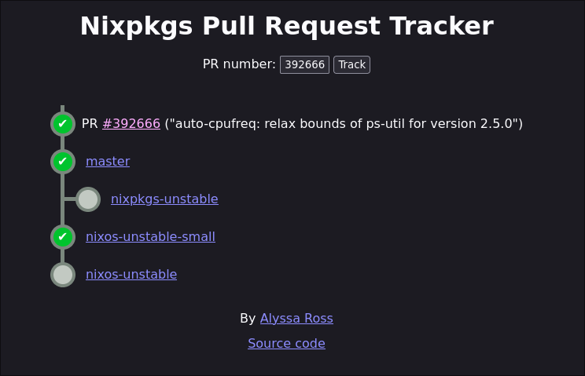

+++
date = '2025-03-26T16:47:29+01:00'
draft = false
title = 'Patching Nixpkgs With Pull Requests'
+++

Updating my Nix channels is always a bit of a gamble. Sometimes, something breaks. Fortunately, because I'm on NixOS, this never results in a completely broken system; it just prevents an update. Still, it's an annoying inconvenience.

One of the benefits of using NixOS is the strong community around it. Typically, when something breaks, someone has already reported the issue in the [nixpkgs repository](https://github.com/NixOS/nixpkgs) and, often, submitted a pull request with a fix. In my case, the solution was already available in [PR #392666](https://github.com/NixOS/nixpkgs/pull/392666), and it had even been merged!

However, using the ever-useful [PR tracker](https://nixpk.gs/pr-tracker.html), I realized that while the fix had landed in the `master` branch, it had yet to make its way to `nixpkgs-unstable` or `nixos-unstable`, which I use.



From experience, I knew it could take a few days for the change to propagate to `nixos-unstable`, effectively blocking my system updates. Rather than waiting (as I usually do), I decided to find a way to manually apply the fix, making updating possible while integrating patches from PRs.

## Patching nixpkgs

To begin, we need a modified version of `nixpkgs` that includes the `system` attribute; otherwise, `currentSystem` will be missing.

```nix
pre-nixpkgs = import inputs.nixpkgs { inherit system; };
```

The approach relies on the [`applyPatches`](https://noogle.dev/f/pkgs/applyPatches) function from `nixpkgs`, which requires three arguments: a name, a source, and a list of patches to apply.

```nix
nixpkgs-patched = pre-nixpkgs.applyPatches {
  name = "nixpkgs-patched";
  src = pre-nixpkgs;
  patches = [
    ./patches/1.patch
  ];
};
```

Rather than downloading patch files manually, we can use the `fetchpatch` function to retrieve patches directly from a pull request. On GitHub, appending `.patch` to a PR or commit URL leads to the raw patch file. For example, the patch for PR #392666 can be accessed at:

[`https://patch-diff.githubusercontent.com/raw/NixOS/nixpkgs/pull/392666.patch`](https://patch-diff.githubusercontent.com/raw/NixOS/nixpkgs/pull/392666.patch)

We can then integrate it directly into our patch list:

```nix
patches = [
  (pre-nixpkgs.fetchpatch {
    name = "auto-cpufreq";
    url = "https://patch-diff.githubusercontent.com/raw/NixOS/nixpkgs/pull/392666.patch";
    sha256 = "sha256-qm4OANl1xUu1kbL65J5wjopQIZF/eflrkpc/MOnLg84=";
  })
];
```

And it worked!

## Making It Future-Proof

Since I knew this patch would become obsolete in a few days but that similar situations would arise in the future, I wrote a more general function that allows defining patches using a simple list of PR IDs and SHA256 hashes:

```nix
patches = [
  {
    name = "auto-cpufreq";
    id = "392666";
    sha256 = "sha256-qm4OANl1xUu1kbL65J5wjopQIZF/eflrkpc/MOnLg84=";
  }
];
```

I then modified my [`lib/default.nix`](https://github.com/BhasherBEL/dotfiles-nix/blob/fa36179ea0858cc1386e2b4a0f29193bdfd355ba/lib/default.nix#L16) to integrate this logic before `makeNixosSystem`, ensuring it consistently applies patches before evaluating the system.

```nix
let
  pre-nixpkgs = import inputs.nixpkgs { inherit system; };
  nixpkgs-patched = pre-nixpkgs.applyPatches {
    name = "nixpkgs-patched";
    src = inputs.nixpkgs;
    patches = builtins.map (patch:
      pre-nixpkgs.fetchpatch {
        name = patch.name or "pr-${patch.id}";
        url = "https://patch-diff.githubusercontent.com/raw/NixOS/nixpkgs/pull/${patch.id}.patch";
        sha256 = patch.sha256 or "";
      }
    ) patches;
  };
  nixpkgs = nixpkgs-patched;
  lib = nixpkgs.lib // inputs.home-manager.lib;
  nixosSystem = import (nixpkgs + "/nixos/lib/eval-config.nix");
in {
  inherit lib;
}
```

## Sources

- https://ertt.ca/nix/patch-nixpkgs/
- https://uninsane.org/blog/nixos-upstreaming/
- https://wiki.nixos.org/wiki/Nixpkgs/Patching_Nixpkgs
- https://noogle.dev/f/pkgs/applyPatches
